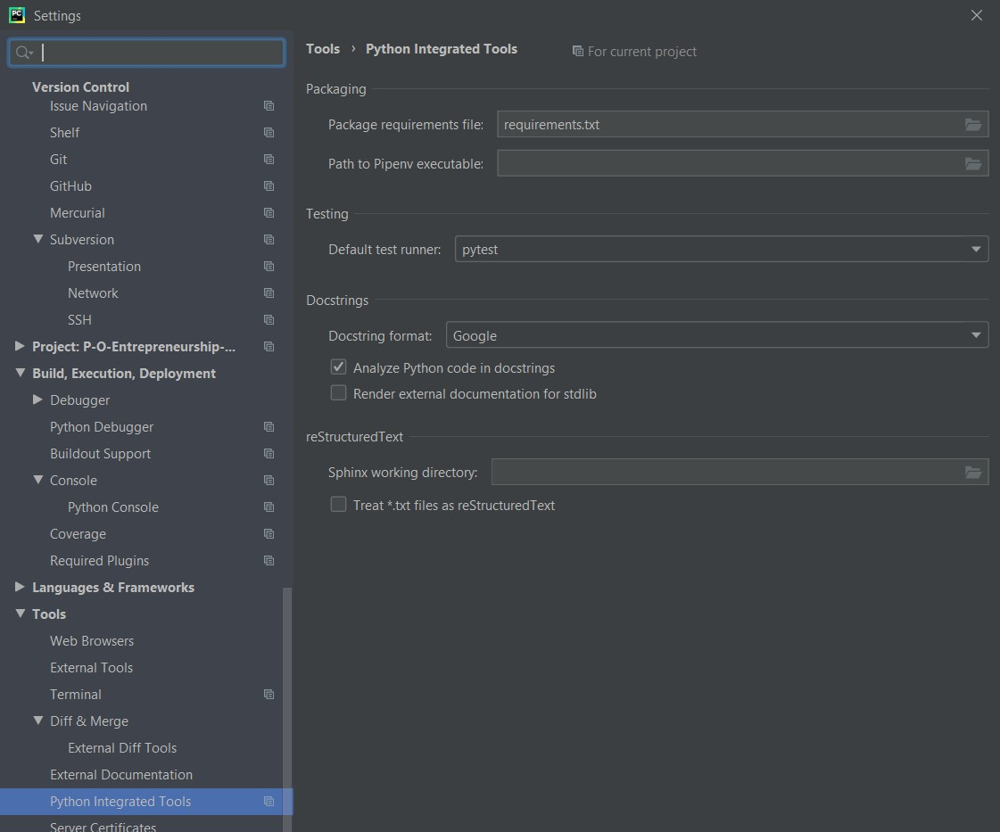

# P&O Entrepreneurship - Team A - Virtual Company Assistant (code)

## Set-up
###### Set up the Virtual Environment using PyCharm
1. Install Anaconda and PyCharm, if you haven't done that already.
2. Make sure to have cloned this repository to your computer.
3. Create a new *empty* directory outside the repository, e.g. `venv` or leave the environment location just the way it is (this might work better in case of problems). Avoid creating the directory in the repository, because it will contain system specific files that should not be synchronised by Git.
4. Open PyCharm.
5. Create a conda virtual environment following the [PyCharm instructions](https://www.jetbrains.com/help/pycharm/conda-support-creating-conda-virtual-environment.html). **Select the newly created directory as the environment location.** For example
```
D:\Documents\venv
```

6. If this doesn't work, make sure the path to the conda interpreter is valid. Also, in case any other conda environments exist, PyCharm might create a normal virtual environment instead of a conda environment without notifying you. **Make sure the icon of the interpreter is the Anaconda icon or if it is not, check whether there is an Anaconda toggle button available to use the Conda Package Manager.**

:ok: When opening the Terminal in PyCharm, you should see the path to your virtual environment between brackets in front of the current path:
```
(D:\Documents\venv) D:\Documents\P-O-Entrepreneurship-Team-A-code>
```

###### When you need a library that hasn't been installed yet
1. Open PyCharm
2. Install package/library following the [instructions from the PyCharm documentation](https://www.jetbrains.com/help/pycharm/installing-uninstalling-and-upgrading-packages.html).

:warning: Make sure the "Use Conda Package Manager" toggle is enabled.

4. Add a line to the `requirements.txt` file in the root of the repo: `[package-name]==[installed-version]`, e.g. `pdoc3==0.7.2`
5. In case the freshly installed package required other packages, add those packages to `requirements.txt` too with the correct version number.

:warning: Make sure to commit and push this change.

###### When someone else has added libraries to the `requirements.txt` file that you haven't installed yet
1. PyCharm will show a bar "Package requirement	... not satisfied".
2. Click the install link to install missing packages.

:warning: Even after installing the package `vs2015_runtime==14.16.27012` PyCharm may tell you it hasn't been installed. Ensure it is installed by looking at the package list (in Settings) and click *Ignore requirement*.
 
:warning: In case PyCharm might not find the `requirements.txt` file, go to the [section on settings](#settings-for-documentation-testing-and-requirementstxt).

###### Testing whether set-up is working
- For now, I don't know what's the best way to test this, but I'd recommend to follow above steps and afterwards open the Terminal (*not the Python Console*) in PyCharm.
Execute
```
pdoc
```
This should return something like
```
usage: pdoc-script.py [-h] [--version] [-c OPTION=VALUE] [--filter STRING]
                      [-f] [--html | --pdf] [-o DIR] [--template-dir DIR]
                      [--close-stdin] [--http HOST:PORT]
                      MODULE [MODULE ...]
pdoc-script.py: error: the following arguments are required: MODULE
```

###### Settings for documentation, testing and `requirements.txt`
- For writing documentation, the easiest way is to use `pdoc`, which supports several docstring formats. To make PyCharm use the [Google docstring format](http://google.github.io/styleguide/pyguide.html#38-comments-and-docstrings), go to Settings > Tools > Python integrated tools and select *Google* in the dropdown menu next to *Docstring format*.
- In the same window select *pytest* as the *Default test runner*, so PyCharm uses this test suite for testing.

     :warning: PyCharm may show the message *No Pytest runner found in selected interpreter* in the bottom of this window. Click *Fix* to install `pytest`, because for some reason PyCharm hasn't installed it, even though it is in the `requirements.txt` file.

- In case PyCharm might not find the `requirements.txt` file, you can explicitly show it by entering *requirements.txt* in the field *Package requirements file*.

See screenshot:


 
## Expanding this `README`
For basic styling, check out the [guidelines by GitHub](https://help.github.com/en/github/writing-on-github/basic-writing-and-formatting-syntax#section-links). 